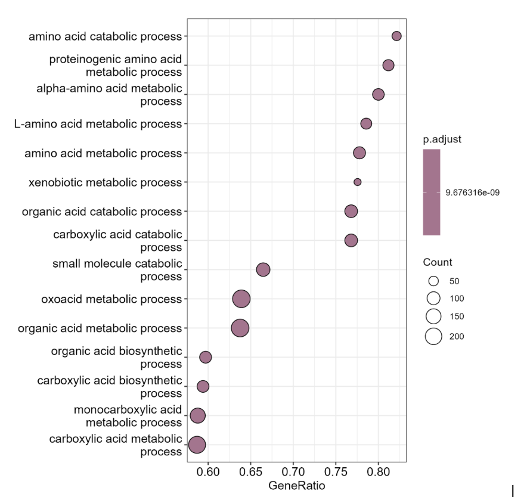
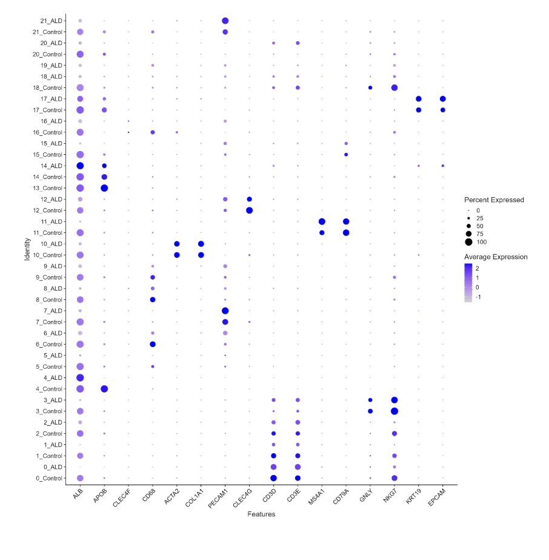
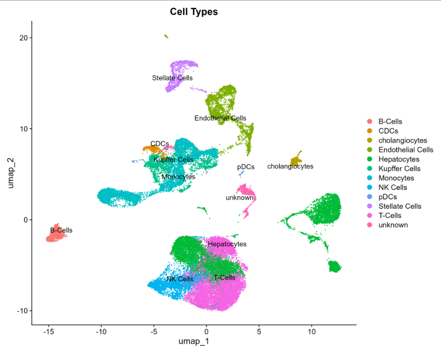

## Key findings

- ALD is associated with widespread transcriptional changes across liver cell populations, with distinct gene expression patterns observed between disease and control samples.
- Cell-type composition and behavior are altered in ALD, indicating that disease progression involves both shifts in cell abundance and functional state.
- Immune cells show the most pronounced changes, with coordinated downregulation of immune-related pathways across multiple cell types.
- B cells exhibit the strongest suppression of immune pathways, suggesting impaired humoral immune function in ALD.
- Monocytes display evidence of functional reprogramming, characterized by decreased immune activity alongside increased metabolic (ATP-related) pathway enrichment.
- Pathway-level changes are highly cell-type specific, highlighting the importance of single-cell resolution for understanding disease mechanisms.

Overall, these results support immune dysfunction and metabolic alteration as central features of ALD pathophysiology.

---

## Figures

## Initial GSEA Plot
{fig-cap="GSEA results showing metabolic pathway enrichment."}

## dotplot
{fig-cap="dotplot results comparing cell types with average gene expression of common markers."}

## UMAP
{fig-cap="UMAP comparing cell clusters"}

## Interactive GSEA by Cell Type

To avoid stacking all cell-type-specific pathway enrichment plots vertically, this section provides an interactive viewer for comparing GSEA results across annotated liver cell populations. Use the dropdown menu or the previous/next buttons to browse enrichment patterns for each cell type.

  <label for="gseaSelect"><strong>Select GSEA plot:</strong></label>
  <select id="gseaSelect" onchange="updateGSEA()" style="margin-left: 8px; padding: 4px;">
    <option value="figures/celltype_proportions_ALD_vs_Control.png" selected>Cell Type Proportions: ALD vs Control</option>
    <option value="figures/GSEA_Test_B_Cells.png">GSEA - B Cells</option>
    <option value="figures/GSEA_Test_CDCs.png">GSEA - cDCs</option>
    <option value="figures/GSEA_Test_cholangiocytes.png">GSEA - Cholangiocytes</option>
    <option value="figures/GSEA_Test_Endothelial_Cells.png">GSEA - Endothelial Cells</option>
    <option value="figures/GSEA_Test_Hepatocytes.png">GSEA - Hepatocytes</option>
    <option value="figures/GSEA_Test_Kupffer_Cells.png">GSEA - Kupffer Cells</option>
    <option value="figures/GSEA_Test_Monocytes.png">GSEA - Monocytes</option>
    <option value="figures/GSEA_Test_NK_Cells.png">GSEA - NK Cells</option>
    <option value="figures/GSEA_Test_Stellate_Cells.png">GSEA - Stellate Cells</option>
    <option value="figures/GSEA_Test_T_Cells.png">GSEA - T Cells</option>
    <option value="figures/immune_DE_magnitude_barplot.png">Immune Cell Transcriptional Disruption</option>
    <option value="figures/immune_GSEA_heatmap.png">Immune Pathway Activation Heatmap</option>
  </select>

  <button onclick="prevGSEA()" style="margin-left: 10px;">Previous</button>
  <button onclick="nextGSEA()">Next</button>

  

    Global gene set enrichment analysis comparing ALD and control samples across the integrated dataset.
  

  

## Interactive FeaturePlot Viewer by Cell Type

This viewer allows interactive comparison of marker-based feature plots used to validate cell-type annotations across the integrated UMAP. Use the dropdown menu or the previous/next buttons to browse marker panels for each annotated cell population.

  <label for="featureSelect"><strong>Select feature plot:</strong></label>
  <select id="featureSelect" onchange="updateFeaturePlot()" style="margin-left: 8px; padding: 4px;">
    <option value="figures/FeaturePlot_B_cells_Marker.png" selected>B Cells Markers</option>
    <option value="figures/FeaturePlot_cDCs_Marker.png">cDC Markers</option>
    <option value="figures/FeaturePlot_Cholangiocytes_Marker.png">Cholangiocyte Markers</option>
    <option value="figures/FeaturePlot_Endothelial_cells_Marker.png">Endothelial Cell Markers</option>
    <option value="figures/FeaturePlot_gdT_NKT_Marker.png">gdT / NKT Markers</option>
    <option value="figures/FeaturePlot_Hepatocyte_stress_Marker.png">Hepatocyte Stress Markers</option>
    <option value="figures/FeaturePlot_Hepatocytes_Marker.png">Hepatocyte Markers</option>
    <option value="figures/FeaturePlot_Kupffer_cells_Marker.png">Kupffer Cell Markers</option>
    <option value="figures/FeaturePlot_Monocytes_Marker.png">Monocyte Markers</option>
    <option value="figures/FeaturePlot_NK_cells_Marker.png">NK Cell Markers</option>
    <option value="figures/FeaturePlot_pDCs_Marker.png">pDC Markers</option>
    <option value="figures/FeaturePlot_Stellate_cells_Marker.png">Stellate Cell Markers</option>
    <option value="figures/FeaturePlot_T_cells_Marker.png">T Cell Markers</option>
  </select>

  <button onclick="prevFeaturePlot()" style="margin-left: 10px;">Previous</button>
  <button onclick="nextFeaturePlot()">Next</button>

  

    Feature plots for B-cell markers showing where canonical B-cell genes are expressed across the integrated UMAP.
  

  

---

## discussion

The results of this project support the hypothesis that immune cell populations in ALD livers actively show distinct gene-expression changes compared to healthy, control livers. Importantly, these changes are not uniform across immune populations — each cell type shows a distinct transcriptional signature, which highlights the importance of single-cell resolution for understanding ALD pathophysiology.

The most prominent finding was the strong transcriptional disruption in T cells, which also increased in proportion in ALD. This combination of increased abundance and loss of cytotoxic effector programs is consistent with published reports of T cell exhaustion and dysfunction in chronic liver disease [@li2019; @albillos2014]. In healthy liver, T cells and NK cells together provide cytotoxic immune surveillance. The parallel suppression of NK cell cytotoxic pathways observed here — alongside decreased NK cell abundance — suggests that both arms of cytotoxic immunity are simultaneously weakened in ALD. This finding aligns with work showing that NK cell activity is impaired in patients with alcoholic liver disease [@ju2015].

Monocyte findings support the concept of immunometabolic reprogramming in ALD. The shift toward increased metabolic (ATP-related) pathway activity alongside decreased inflammatory immune signaling is consistent with the idea that monocytes in chronically inflamed tissue can transition from classically activated, pro-inflammatory states to altered metabolic states [@oishi2024; @mcclain2002]. A similar monocyte metabolic shift has been reported in other inflammatory contexts, including viral infection [@cory2021], lending biological plausibility to the ALD findings reported here.

The complement suppression signal observed broadly across cell types — including non-immune populations such as hepatocytes and endothelial cells — represents perhaps the most novel finding of this project. While complement dysfunction has been described in liver disease generally [@gao2011], the consistency of complement pathway suppression across nearly all annotated cell types in this dataset suggests a systemic and widespread disruption of immune homeostasis rather than a cell-type-specific effect. This shared signal may represent a meaningful new observation about the breadth of immune dysregulation in ALD.

Conventional dendritic cells stood out as an exception. Unlike other immune populations, cDCs upregulated antigen presentation and T-cell priming pathways in ALD. This is consistent with published work showing that dendritic cells can remain or become more active in inflammatory environments even when other immune populations are suppressed [@krenkel2017]. Continued cDC activity alongside T cell and NK cell dysfunction could contribute to chronic, non-resolving inflammation — a hallmark of advanced ALD.

Hepatocyte findings, including reduced expression of *ALB* and *APOB*, are consistent with impaired metabolic liver function in ALD and align with clinical observations of hypoalbuminemia and dyslipidemia in patients with alcoholic liver disease [@seitz2018; @crabb2020]. Taken together, the transcriptional landscape identified here is consistent with ALD being understood not only as direct hepatocyte injury from alcohol metabolism, but as a disease in which immune dysregulation actively shapes disease progression.

## references